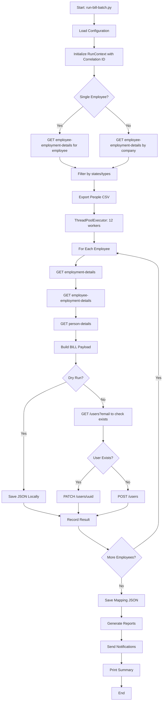
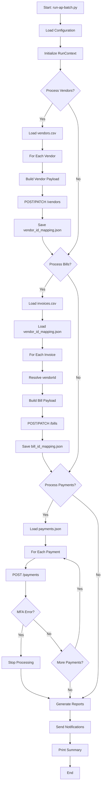

# BILL.com Integration - Batch Job Execution Flow

## Overview

This document describes the sequential execution flow when running batch jobs to sync data from UKG Pro to BILL.com. There are two main batch jobs:

1. **S&E Batch Job** (`run-bill-batch.py`) - Syncs UKG employees to BILL.com Spend & Expense users
2. **AP Batch Job** (`run-ap-batch.py`) - Syncs vendors, invoices, and payments to BILL.com Accounts Payable

---

## Prerequisites

### Environment Variables

```bash
# UKG Configuration
UKG_BASE_URL=https://service4.ultipro.com
UKG_USERNAME=your-username
UKG_PASSWORD=your-password
UKG_CUSTOMER_API_KEY=your-customer-api-key
UKG_BASIC_B64=                          # Optional: pre-encoded base64(username:password)

# BILL.com Configuration
BILL_API_BASE=https://gateway.stage.bill.com/connect/v3/spend
BILL_API_TOKEN=your-api-token

# Batch Configuration
WORKERS=12                               # Thread pool size
LIMIT=0                                  # 0 = all, >0 = limit for testing
SAVE_LOCAL=0                             # 1 = save JSON files locally
DEBUG=0                                  # 1 = verbose logging
```

---

## Part 1: S&E Batch Job Flow (run-bill-batch.py)

### Usage

```bash
python run-bill-batch.py --company-id J9A6Y [options]

# Options:
#   --company-id ID           UKG company ID (required)
#   --employee-number NUM     Process single employee (bypasses company-id)
#   --states FL,MS,NJ         Filter by US states
#   --employee-type-codes FTC,HRC  Filter by employee types
#   --workers 12              Thread pool size
#   --dry-run                 Validate without posting to BILL
#   --save-local              Save JSON payloads locally
#   --limit 10                Process only N records (testing)
```

### Sequential Execution Steps

```
┌─────────────────────────────────────────────────────────────────────────────┐
│ STEP 1: Initialize                                                          │
├─────────────────────────────────────────────────────────────────────────────┤
│ • Load .env configuration                                                   │
│ • Parse CLI arguments                                                       │
│ • Initialize correlation ID (unique per run)                                │
│ • Configure logging with PII redaction                                      │
│ • Initialize rate limiter (60 calls/min for BILL)                          │
│ • Initialize notifier (optional email notifications)                        │
│ • Initialize report generator                                               │
└─────────────────────────────────────────────────────────────────────────────┘
                                    │
                                    ▼
┌─────────────────────────────────────────────────────────────────────────────┐
│ STEP 2: Fetch Employees from UKG                                            │
├─────────────────────────────────────────────────────────────────────────────┤
│ GET /personnel/v1/employee-employment-details                               │
│   ?companyId={company_id}&per_Page=2147483647                              │
│                                                                             │
│ • Returns list of employees with employeeNumber, employeeID, projectCode   │
│ • Filter by --employee-type-codes if specified                             │
│ • Filter by --states if specified (requires person-details lookup)         │
│ • Apply --limit if specified                                                │
└─────────────────────────────────────────────────────────────────────────────┘
                                    │
                                    ▼
┌─────────────────────────────────────────────────────────────────────────────┐
│ STEP 3: Export People CSV (Optional)                                        │
├─────────────────────────────────────────────────────────────────────────────┤
│ For each employee:                                                          │
│   • GET /personnel/v1/person-details?employeeId={id}                       │
│   • Resolve supervisor email (3 fallback strategies)                       │
│   • Format cost center from primaryProjectCode                             │
│   • Write row to people-{timestamp}.csv                                    │
└─────────────────────────────────────────────────────────────────────────────┘
                                    │
                                    ▼
┌─────────────────────────────────────────────────────────────────────────────┐
│ STEP 4: Build & Upsert Users (Parallel - ThreadPoolExecutor)                │
├─────────────────────────────────────────────────────────────────────────────┤
│ For each employee (12 workers in parallel):                                 │
│                                                                             │
│   4a. Fetch UKG Data:                                                       │
│       GET /personnel/v1/employment-details                                  │
│       GET /personnel/v1/employee-employment-details                         │
│       GET /personnel/v1/person-details                                      │
│                                                                             │
│   4b. Build BILL Payload:                                                   │
│       • email: person.emailAddress                                          │
│       • firstName: person.firstName                                         │
│       • lastName: person.lastName                                           │
│       • role: MEMBER (default)                                              │
│       • retired: false if active, true if terminated                       │
│                                                                             │
│   4c. Save Locally (if --save-local or --dry-run):                         │
│       → data/batch/bill_entity_{employeeNumber}.json                       │
│                                                                             │
│   4d. Upsert to BILL API:                                                   │
│       • Check if exists: GET /users?email={email}                          │
│       • If exists: PATCH /users/{uuid}                                     │
│       • If not exists: POST /users                                         │
│                                                                             │
│   4e. Record result in mapping:                                             │
│       employeeNumber → BILL UUID                                            │
└─────────────────────────────────────────────────────────────────────────────┘
                                    │
                                    ▼
┌─────────────────────────────────────────────────────────────────────────────┐
│ STEP 5: Save Mapping & Generate Reports                                     │
├─────────────────────────────────────────────────────────────────────────────┤
│ • Save: data/batch/employee_to_bill_uuid_mapping.json                      │
│ • Generate run report: data/reports/run_report_{timestamp}.json            │
│ • Generate validation report (target: 99% success rate)                    │
│ • Send email notification (if configured)                                  │
│ • Print summary: correlation_id, duration, stats                           │
└─────────────────────────────────────────────────────────────────────────────┘
```

### Flow Diagram (Mermaid)



---

## Part 2: AP Batch Job Flow (run-ap-batch.py)

### Usage

```bash
python run-ap-batch.py --vendors --bills [--payments] [options]

# Options:
#   --vendors               Process vendors from CSV
#   --bills                 Process bills/invoices from CSV
#   --payments              Process payments (requires MFA)
#   --vendors-csv FILE      Path to vendors CSV
#   --bills-csv FILE        Path to invoices CSV
#   --payments-json FILE    Path to payments JSON
#   --dry-run               Validate without posting
#   --limit N               Process only N records
#   --no-notify             Skip email notifications
```

### Sequential Execution Steps

```
┌─────────────────────────────────────────────────────────────────────────────┐
│ STEP 1: Initialize                                                          │
├─────────────────────────────────────────────────────────────────────────────┤
│ • Load .env configuration                                                   │
│ • Parse CLI arguments (--vendors, --bills, --payments)                     │
│ • Initialize RunContext with correlation ID                                │
│ • Initialize notifier and report generator                                 │
└─────────────────────────────────────────────────────────────────────────────┘
                                    │
                                    ▼
┌─────────────────────────────────────────────────────────────────────────────┐
│ STEP 2: Process Vendors (if --vendors flag)                                 │
├─────────────────────────────────────────────────────────────────────────────┤
│ For each vendor in CSV:                                                     │
│   • Load vendor data from CSV row                                          │
│   • Build vendor payload (name, email, address, paymentTerms)              │
│   • Save: data/vendors/vendor_{id}.json                                    │
│   • POST /vendors or PATCH /vendors/{id} if exists                        │
│   • Record in vendor_id_mapping.json                                       │
└─────────────────────────────────────────────────────────────────────────────┘
                                    │
                                    ▼
┌─────────────────────────────────────────────────────────────────────────────┐
│ STEP 3: Process Bills/Invoices (if --bills flag)                            │
├─────────────────────────────────────────────────────────────────────────────┤
│ For each invoice in CSV:                                                    │
│   • Load invoice data from CSV row                                         │
│   • Resolve vendorId from vendor_id_mapping.json                           │
│   • Build bill payload (vendorId, invoiceNumber, dueDate, lineItems)      │
│   • Save: data/bills/bill_{invoiceNumber}.json                            │
│   • POST /bills or PATCH /bills/{id} if exists                            │
│   • Record in bill_id_mapping.json                                        │
└─────────────────────────────────────────────────────────────────────────────┘
                                    │
                                    ▼
┌─────────────────────────────────────────────────────────────────────────────┐
│ STEP 4: Process Payments (if --payments flag)                               │
├─────────────────────────────────────────────────────────────────────────────┤
│ ⚠️  WARNING: Requires MFA-trusted API session                               │
│                                                                             │
│ For each payment in JSON:                                                   │
│   • Extract: billId, amount, processDate, fundingAccountId                 │
│   • POST /payments (or /bills/record-payment for external)                 │
│   • If MFA error: stop processing                                          │
└─────────────────────────────────────────────────────────────────────────────┘
                                    │
                                    ▼
┌─────────────────────────────────────────────────────────────────────────────┐
│ STEP 5: Generate Reports & Notifications                                    │
├─────────────────────────────────────────────────────────────────────────────┤
│ • Generate run report with AP summary                                      │
│ • Generate validation report                                               │
│ • Send email notification                                                  │
│ • Print summary (vendors, bills, payments counts)                          │
└─────────────────────────────────────────────────────────────────────────────┘
```

### Flow Diagram (Mermaid)



---

## API Calls with Curl Examples

### UKG API Calls

#### 1. Get Employee Employment Details by Company

```bash
# Step 2: Fetch all employees for a company
curl -X GET "https://service4.ultipro.com/personnel/v1/employee-employment-details?companyId=J9A6Y&per_Page=2147483647" \
  -H "Authorization: Basic ${UKG_BASIC_B64}" \
  -H "US-CUSTOMER-API-KEY: ${UKG_CUSTOMER_API_KEY}" \
  -H "Accept: application/json"

# Expected: 200 OK
# Response:
# [
#   {
#     "employeeNumber": "001234",
#     "employeeID": "abc123-def456",
#     "companyID": "J9A6Y",
#     "primaryProjectCode": "PROJ001",
#     "employeeStatusCode": "A",
#     "employeeTypeCode": "FTC",
#     "terminationDate": null
#   },
#   ...
# ]
```

#### 2. Get Employee Employment Details by Employee Number

```bash
# Step 4a: Fetch employment details for specific employee
curl -X GET "https://service4.ultipro.com/personnel/v1/employee-employment-details?employeeNumber=001234&companyID=J9A6Y" \
  -H "Authorization: Basic ${UKG_BASIC_B64}" \
  -H "US-CUSTOMER-API-KEY: ${UKG_CUSTOMER_API_KEY}" \
  -H "Accept: application/json"

# Expected: 200 OK
```

#### 3. Get Employment Details

```bash
# Step 4a: Fetch employment details (dates, status, org)
curl -X GET "https://service4.ultipro.com/personnel/v1/employment-details?employeeNumber=001234&companyID=J9A6Y" \
  -H "Authorization: Basic ${UKG_BASIC_B64}" \
  -H "US-CUSTOMER-API-KEY: ${UKG_CUSTOMER_API_KEY}" \
  -H "Accept: application/json"

# Expected: 200 OK
# Response:
# {
#   "employeeNumber": "001234",
#   "employeeId": "abc123-def456",
#   "companyID": "J9A6Y",
#   "hireDate": "2020-01-15",
#   "terminationDate": null,
#   "employeeStatusCode": "A"
# }
```

#### 4. Get Person Details

```bash
# Step 4a: Fetch personal info (name, email, address)
curl -X GET "https://service4.ultipro.com/personnel/v1/person-details?employeeId=abc123-def456" \
  -H "Authorization: Basic ${UKG_BASIC_B64}" \
  -H "US-CUSTOMER-API-KEY: ${UKG_CUSTOMER_API_KEY}" \
  -H "Accept: application/json"

# Expected: 200 OK
# Response:
# {
#   "employeeId": "abc123-def456",
#   "firstName": "John",
#   "lastName": "Doe",
#   "emailAddress": "john.doe@example.com",
#   "addressLine1": "123 Main St",
#   "addressCity": "Miami",
#   "addressState": "FL",
#   "addressZipCode": "33101",
#   "homePhone": "305-555-1234"
# }
```

---

### BILL.com Spend & Expense API Calls

#### 5. Search User by Email

```bash
# Step 4d: Check if user exists by email
curl -X GET "https://gateway.stage.bill.com/connect/v3/spend/users?email=john.doe@example.com" \
  -H "apiToken: ${BILL_API_TOKEN}" \
  -H "Accept: application/json"

# Expected: 200 OK
# Response (if found):
# {
#   "users": [
#     {
#       "uuid": "usr_123abc",
#       "id": "00501000000xxxxx",
#       "email": "john.doe@example.com",
#       "firstName": "John",
#       "lastName": "Doe",
#       "role": "MEMBER",
#       "retired": false
#     }
#   ]
# }
```

#### 6. Create User (POST)

```bash
# Step 4d: Create new user in BILL
curl -X POST "https://gateway.stage.bill.com/connect/v3/spend/users" \
  -H "apiToken: ${BILL_API_TOKEN}" \
  -H "Content-Type: application/json" \
  -H "Accept: application/json" \
  -d '{
    "email": "john.doe@example.com",
    "firstName": "John",
    "lastName": "Doe",
    "role": "MEMBER"
  }'

# Expected: 201 Created
# Response:
# {
#   "uuid": "usr_123abc",
#   "id": "00501000000xxxxx",
#   "email": "john.doe@example.com",
#   "firstName": "John",
#   "lastName": "Doe",
#   "role": "MEMBER",
#   "retired": false
# }
```

#### 7. Update User (PATCH)

```bash
# Step 4d: Update existing user in BILL
curl -X PATCH "https://gateway.stage.bill.com/connect/v3/spend/users/usr_123abc" \
  -H "apiToken: ${BILL_API_TOKEN}" \
  -H "Content-Type: application/json" \
  -H "Accept: application/json" \
  -d '{
    "firstName": "John",
    "lastName": "Smith",
    "role": "MEMBER"
  }'

# Expected: 200 OK
```

#### 8. Get Current User (Test Connection)

```bash
# Test API token validity
curl -X GET "https://gateway.stage.bill.com/connect/v3/spend/users/current" \
  -H "apiToken: ${BILL_API_TOKEN}" \
  -H "Accept: application/json"

# Expected: 200 OK
```

---

### BILL.com Accounts Payable API Calls

#### 9. Create Vendor

```bash
# Step 2 (AP): Create vendor
curl -X POST "https://gateway.stage.bill.com/connect/v3/vendors" \
  -H "apiToken: ${BILL_API_TOKEN}" \
  -H "Content-Type: application/json" \
  -H "Accept: application/json" \
  -d '{
    "name": "Acme Corporation",
    "shortName": "ACME",
    "email": "accounts@acme.com",
    "phone": "555-123-4567",
    "address": {
      "line1": "123 Business Ave",
      "line2": "Suite 100",
      "city": "San Francisco",
      "state": "CA",
      "zip": "94105",
      "country": "US"
    },
    "paymentTermDays": 30,
    "paymentMethod": "CHECK",
    "taxId": "12-3456789",
    "externalId": "vendor_001"
  }'

# Expected: 201 Created
# Response:
# {
#   "id": "00501000000yyyyy",
#   "name": "Acme Corporation",
#   "externalId": "vendor_001"
# }
```

#### 10. Create Bill/Invoice

```bash
# Step 3 (AP): Create bill/invoice
curl -X POST "https://gateway.stage.bill.com/connect/v3/bills" \
  -H "apiToken: ${BILL_API_TOKEN}" \
  -H "Content-Type: application/json" \
  -H "Accept: application/json" \
  -d '{
    "vendorId": "00501000000yyyyy",
    "invoice": {
      "number": "INV-2024-001",
      "date": "2024-03-22"
    },
    "dueDate": "2024-04-22",
    "billLineItems": [
      {
        "amount": 1500.00,
        "description": "Consulting services - March 2024",
        "glAccountId": "optional-gl-id",
        "departmentId": "optional-dept-id"
      }
    ],
    "poNumber": "PO-2024-100",
    "externalId": "INV-2024-001"
  }'

# Expected: 201 Created
# Response:
# {
#   "id": "00501000000zzzzz",
#   "invoice": {
#     "number": "INV-2024-001"
#   }
# }
```

#### 11. Create Payment

```bash
# Step 4 (AP): Create payment (requires MFA-trusted session)
curl -X POST "https://gateway.stage.bill.com/connect/v3/payments" \
  -H "apiToken: ${BILL_API_TOKEN}" \
  -H "Content-Type: application/json" \
  -H "Accept: application/json" \
  -d '{
    "billId": "00501000000zzzzz",
    "amount": 1500.00,
    "processDate": "2024-04-15",
    "fundingAccountId": "account-id-here",
    "paymentMethod": "CHECK"
  }'

# Expected: 201 Created
# Note: May return 401/403 if MFA not completed
```

#### 12. Record External Payment

```bash
# Step 4 (AP): Record payment made outside BILL
curl -X POST "https://gateway.stage.bill.com/connect/v3/bills/record-payment" \
  -H "apiToken: ${BILL_API_TOKEN}" \
  -H "Content-Type: application/json" \
  -H "Accept: application/json" \
  -d '{
    "billId": "00501000000zzzzz",
    "amount": 1500.00,
    "paymentDate": "2024-04-15",
    "paymentMethod": "EXTERNAL",
    "referenceNumber": "CHK-12345"
  }'

# Expected: 200 OK
```

---

## Error Handling

### HTTP Status Codes

| Code | Meaning | Action |
|------|---------|--------|
| 200 | Success | Continue |
| 201 | Created | Record new ID |
| 204 | No Content | Success (PATCH) |
| 400 | Bad Request | Log error, skip record |
| 401 | Unauthorized | Check API token |
| 403 | Forbidden | Check MFA status |
| 404 | Not Found | Create new record |
| 409 | Conflict | User exists, try update |
| 429 | Rate Limited | Wait and retry |
| 5xx | Server Error | Exponential backoff retry |

### Rate Limiting

- BILL.com: 60 calls/minute
- UKG: No documented limit (use 60/min for safety)
- Implementation: Token bucket algorithm with automatic wait

### Retry Strategy

- Max retries: 2 (configurable via MAX_RETRIES)
- Backoff: Exponential (1s, 2s, 4s...)
- Retryable: 5xx errors, timeouts

---

## Output Files

| File Path | Description |
|-----------|-------------|
| `data/batch/bill_entity_{empNum}.json` | S&E user payload |
| `data/batch/employee_to_bill_uuid_mapping.json` | Employee → BILL UUID mapping |
| `data/people-{timestamp}.csv` | People CSV for BILL import |
| `data/vendors/vendor_{id}.json` | Vendor payload |
| `data/vendors/vendor_id_mapping.json` | Vendor ID mapping |
| `data/bills/bill_{invoiceNum}.json` | Bill/invoice payload |
| `data/bills/bill_id_mapping.json` | Bill ID mapping |
| `data/reports/run_report_{timestamp}.json` | Execution report |

---

## Field Mapping: UKG → BILL

### S&E User Fields

| UKG Field | UKG Endpoint | BILL Field |
|-----------|--------------|------------|
| `emailAddress` | person-details | `email` |
| `firstName` | person-details | `firstName` |
| `lastName` | person-details | `lastName` |
| `employeeStatusCode` = 'A' | employment-details | `retired: false` |
| `employeeStatusCode` != 'A' | employment-details | `retired: true` |
| (default) | - | `role: "MEMBER"` |

### Validation Rules

- Email: Required, must contain `@`
- State: 2-letter US state code (uppercase)
- Phone: 10 digits formatted as `XXX-XXX-XXXX`
- Role: Must be one of: `ADMIN`, `AUDITOR`, `BOOKKEEPER`, `MEMBER`, `NO_ACCESS`
