# TravelPerk Integration - Batch Job Execution Flow

## Overview

This document describes the sequential execution flow when running the batch job to sync employees from UKG Pro to TravelPerk via SCIM API. The integration uses a **two-phase sync** to handle supervisor/manager relationships correctly.

**Key Feature:** Supervisors are synced first (Phase 1) so their TravelPerk IDs can be referenced when syncing employees with supervisors (Phase 2).

---

## Prerequisites

### Environment Variables

```bash
# UKG Configuration
UKG_BASE_URL=https://service4.ultipro.com
UKG_USERNAME=your-username
UKG_PASSWORD=your-password
UKG_CUSTOMER_API_KEY=your-customer-api-key
UKG_BASIC_B64=                          # Optional: pre-encoded base64(username:password)
UKG_TIMEOUT=45

# TravelPerk Configuration
TRAVELPERK_API_BASE=https://app.sandbox-travelperk.com   # or production URL
TRAVELPERK_API_KEY=your-api-key
TRAVELPERK_TIMEOUT=60

# Batch Configuration
COMPANY_ID=J9A6Y
WORKERS=12                               # Thread pool size
RATE_LIMIT_CALLS_PER_MINUTE=100         # TravelPerk rate limit
MAX_RETRIES=2
LIMIT=0                                  # 0 = all, >0 = limit for testing
SAVE_LOCAL=0                             # 1 = save JSON files locally
DRY_RUN=0                                # 1 = validate without posting
DEBUG=0                                  # 1 = verbose logging

# Optional Filters
STATES=FL,MS,NJ                          # Filter by US states
EMPLOYEE_TYPE_CODES=FTC,HRC,TMC          # Filter by employee types
```

---

## Usage

```bash
python run-travelperk-batch.py --company-id J9A6Y [options]

# Options:
#   --company-id ID              UKG company ID (required)
#   --states FL,MS,NJ            Filter by US states
#   --employee-type-codes FTC,HRC  Filter by employee types
#   --workers 12                 Thread pool size
#   --dry-run                    Validate without posting to TravelPerk
#   --save-local                 Save JSON payloads locally
#   --limit 10                   Process only N records per phase
#   --insert-supervisor IDs      Pre-insert supervisors (comma-separated)
```

---

## Sequential Execution Steps

```
┌─────────────────────────────────────────────────────────────────────────────┐
│ STEP 1: Initialize                                                          │
├─────────────────────────────────────────────────────────────────────────────┤
│ • Load .env configuration via BatchSettings                                │
│ • Parse CLI arguments                                                       │
│ • Initialize UKGClient with Basic Auth + API Key                           │
│ • Initialize TravelPerkClient with API Key                                 │
│ • Initialize UserSyncService                                               │
│ • Initialize rate limiter (100 calls/min for TravelPerk)                   │
└─────────────────────────────────────────────────────────────────────────────┘
                                    │
                                    ▼
┌─────────────────────────────────────────────────────────────────────────────┐
│ STEP 2: Pre-Insert Supervisors (Optional)                                   │
├─────────────────────────────────────────────────────────────────────────────┤
│ If --insert-supervisor specified:                                           │
│   For each supervisor employeeNumber:                                       │
│     • Fetch UKG data (employment-details, person-details)                  │
│     • Build TravelPerkUser (no manager reference)                          │
│     • POST /api/v2/scim/Users                                              │
│     • Record: employeeNumber → TravelPerk ID                               │
└─────────────────────────────────────────────────────────────────────────────┘
                                    │
                                    ▼
┌─────────────────────────────────────────────────────────────────────────────┐
│ STEP 3: Fetch All Employees from UKG                                        │
├─────────────────────────────────────────────────────────────────────────────┤
│ GET /personnel/v1/employee-employment-details                               │
│   ?companyId={company_id}&per_Page=2147483647                              │
│                                                                             │
│ • Returns list of employees with employeeNumber, employeeID, projectCode   │
│ • Filter by --employee-type-codes if specified                             │
└─────────────────────────────────────────────────────────────────────────────┘
                                    │
                                    ▼
┌─────────────────────────────────────────────────────────────────────────────┐
│ STEP 4: Fetch Supervisor Relationships                                      │
├─────────────────────────────────────────────────────────────────────────────┤
│ GET /personnel/v1/employee-supervisor-details                               │
│   ?per_Page=2147483647                                                      │
│                                                                             │
│ • Build mapping: employeeNumber → supervisorEmployeeNumber                 │
│ • Split employees into two groups:                                         │
│   - Phase 1: Employees WITHOUT supervisor                                  │
│   - Phase 2: Employees WITH supervisor                                     │
└─────────────────────────────────────────────────────────────────────────────┘
                                    │
                                    ▼
┌─────────────────────────────────────────────────────────────────────────────┐
│ STEP 5: PHASE 1 - Insert Users Without Supervisor                           │
├─────────────────────────────────────────────────────────────────────────────┤
│ ThreadPoolExecutor (12 workers in parallel):                                │
│                                                                             │
│ For each employee WITHOUT supervisor:                                       │
│   5a. Filter by state (if --states specified):                             │
│       GET /personnel/v1/person-details?employeeId={id}                     │
│       Check addressState against filter                                    │
│                                                                             │
│   5b. Build TravelPerkUser:                                                 │
│       • GET employment-details for employeeNumber                          │
│       • GET person-details for employeeId                                  │
│       • Map: externalId, userName, name, active, costCenter                │
│       • NO manager field (Phase 1)                                         │
│                                                                             │
│   5c. Save locally (if --save-local):                                      │
│       → data/batch/travelperk_user_{employeeNumber}.json                   │
│                                                                             │
│   5d. Upsert to TravelPerk:                                                 │
│       • GET /api/v2/scim/Users?filter=externalId eq "{empNum}"            │
│       • If exists: PATCH /api/v2/scim/Users/{id}                          │
│       • If not exists: POST /api/v2/scim/Users                            │
│                                                                             │
│   5e. Record: employeeNumber → TravelPerk ID                               │
└─────────────────────────────────────────────────────────────────────────────┘
                                    │
                                    ▼
┌─────────────────────────────────────────────────────────────────────────────┐
│ STEP 6: PHASE 2 - Insert Users With Supervisor                              │
├─────────────────────────────────────────────────────────────────────────────┤
│ ThreadPoolExecutor (12 workers in parallel):                                │
│                                                                             │
│ For each employee WITH supervisor:                                          │
│   6a. Resolve supervisor TravelPerk ID:                                    │
│       • Look up supervisorEmployeeNumber in Phase 1 mapping                │
│       • If not found: GET /api/v2/scim/Users?filter=externalId eq "..."   │
│                                                                             │
│   6b. Filter by state (same as Phase 1)                                    │
│                                                                             │
│   6c. Build TravelPerkUser:                                                 │
│       • Same as Phase 1, BUT                                               │
│       • Set manager_id = supervisor's TravelPerk ID                        │
│                                                                             │
│   6d. Save locally (if --save-local)                                       │
│                                                                             │
│   6e. Upsert to TravelPerk:                                                 │
│       • Include manager field in SCIM payload                              │
│       • PATCH with manager.value if updating                               │
│                                                                             │
│   6f. Record: employeeNumber → TravelPerk ID                               │
└─────────────────────────────────────────────────────────────────────────────┘
                                    │
                                    ▼
┌─────────────────────────────────────────────────────────────────────────────┐
│ STEP 7: Save Mapping & Summary                                              │
├─────────────────────────────────────────────────────────────────────────────┤
│ • Save: data/batch/employee_to_travelperk_id_mapping.json                  │
│ • Print summary: total mapped, Phase 1 count, Phase 2 count               │
└─────────────────────────────────────────────────────────────────────────────┘
```

---

## Flow Diagram (Mermaid)

```mermaid
flowchart TD
    A[Start: run-travelperk-batch.py] --> B[Load Configuration]
    B --> C[Initialize Clients]
    C --> D{Pre-Insert Supervisors?}

    D -->|Yes| E[For Each Supervisor]
    D -->|No| F[Fetch All Employees]

    E --> E1[GET person-details]
    E1 --> E2[Build TravelPerkUser]
    E2 --> E3[POST /api/v2/scim/Users]
    E3 --> E4[Record ID in Mapping]
    E4 --> F

    F --> G[GET employee-employment-details by company]
    G --> H[GET employee-supervisor-details]
    H --> I[Build Supervisor Mapping]
    I --> J[Split: With/Without Supervisor]

    J --> K[PHASE 1: Users WITHOUT Supervisor]
    K --> L[ThreadPoolExecutor: 12 workers]

    L --> M[For Each Employee]
    M --> N[Filter by State]
    N --> O{Pass Filter?}

    O -->|No| P[Skip]
    O -->|Yes| Q[GET employment-details]

    Q --> R[GET person-details]
    R --> S[Build TravelPerkUser - NO manager]
    S --> T{Dry Run?}

    T -->|Yes| U[Save JSON Locally]
    T -->|No| V[GET /scim/Users?filter=externalId]

    V --> W{User Exists?}
    W -->|Yes| X[PATCH /scim/Users/id]
    W -->|No| Y[POST /scim/Users]

    U --> Z[Record Result]
    X --> Z
    Y --> Z
    P --> Z

    Z --> AA{More Phase 1?}
    AA -->|Yes| M
    AA -->|No| AB[PHASE 2: Users WITH Supervisor]

    AB --> AC[ThreadPoolExecutor: 12 workers]
    AC --> AD[For Each Employee]
    AD --> AE[Resolve Supervisor TravelPerk ID]
    AE --> AF[Filter by State]
    AF --> AG{Pass Filter?}

    AG -->|No| AH[Skip]
    AG -->|Yes| AI[GET employment-details]

    AI --> AJ[GET person-details]
    AJ --> AK[Build TravelPerkUser + manager_id]
    AK --> AL{Dry Run?}

    AL -->|Yes| AM[Save JSON Locally]
    AL -->|No| AN[GET /scim/Users?filter=externalId]

    AN --> AO{User Exists?}
    AO -->|Yes| AP[PATCH with manager]
    AO -->|No| AQ[POST with manager]

    AM --> AR[Record Result]
    AP --> AR
    AQ --> AR
    AH --> AR

    AR --> AS{More Phase 2?}
    AS -->|Yes| AD
    AS -->|No| AT[Save Mapping JSON]

    AT --> AU[Print Summary]
    AU --> AV[End]
```



---

## API Calls with Curl Examples

### UKG API Calls

#### 1. Get All Employee Employment Details by Company

```bash
# Step 3: Fetch all employees for a company
curl -X GET "https://service4.ultipro.com/personnel/v1/employee-employment-details?companyId=J9A6Y&per_Page=2147483647" \
  -H "Authorization: Basic ${UKG_BASIC_B64}" \
  -H "US-CUSTOMER-API-KEY: ${UKG_CUSTOMER_API_KEY}" \
  -H "Accept: application/json"

# Expected: 200 OK
# Response:
# [
#   {
#     "employeeNumber": "001234",
#     "employeeID": "abc123-def456",
#     "companyID": "J9A6Y",
#     "primaryProjectCode": "PROJ001",
#     "employeeStatusCode": "A",
#     "employeeTypeCode": "FTC",
#     "terminationDate": null
#   },
#   ...
# ]
```

#### 2. Get Employment Details for Single Employee

```bash
# Step 5b/6c: Fetch employment details for specific employee
curl -X GET "https://service4.ultipro.com/personnel/v1/employee-employment-details?employeeNumber=001234&companyID=J9A6Y" \
  -H "Authorization: Basic ${UKG_BASIC_B64}" \
  -H "US-CUSTOMER-API-KEY: ${UKG_CUSTOMER_API_KEY}" \
  -H "Accept: application/json"

# Expected: 200 OK
# Response:
# {
#   "employeeNumber": "001234",
#   "employeeID": "abc123-def456",
#   "companyID": "J9A6Y",
#   "primaryProjectCode": "PROJ001",
#   "employeeStatusCode": "A",
#   "terminationDate": null
# }
```

#### 3. Get Person Details

```bash
# Step 5a/5b: Fetch personal info (name, email, state)
curl -X GET "https://service4.ultipro.com/personnel/v1/person-details?employeeId=abc123-def456" \
  -H "Authorization: Basic ${UKG_BASIC_B64}" \
  -H "US-CUSTOMER-API-KEY: ${UKG_CUSTOMER_API_KEY}" \
  -H "Accept: application/json"

# Expected: 200 OK
# Response:
# {
#   "employeeId": "abc123-def456",
#   "firstName": "John",
#   "lastName": "Doe",
#   "emailAddress": "john.doe@example.com",
#   "addressLine1": "123 Main St",
#   "addressCity": "Miami",
#   "addressState": "FL",
#   "addressZipCode": "33101"
# }
```

#### 4. Get All Supervisor Details

```bash
# Step 4: Fetch supervisor relationships
curl -X GET "https://service4.ultipro.com/personnel/v1/employee-supervisor-details?per_Page=2147483647" \
  -H "Authorization: Basic ${UKG_BASIC_B64}" \
  -H "US-CUSTOMER-API-KEY: ${UKG_CUSTOMER_API_KEY}" \
  -H "Accept: application/json"

# Expected: 200 OK
# Response:
# [
#   {
#     "employeeNumber": "001234",
#     "supervisorEmployeeNumber": "000567"
#   },
#   {
#     "employeeNumber": "001235",
#     "supervisorEmployeeNumber": null
#   },
#   ...
# ]
```

---

### TravelPerk SCIM API Calls

#### 5. Search User by External ID (Employee Number)

```bash
# Step 5d/6e: Check if user exists by externalId
curl -X GET "https://app.sandbox-travelperk.com/api/v2/scim/Users?filter=externalId%20eq%20%22001234%22" \
  -H "Authorization: ApiKey ${TRAVELPERK_API_KEY}" \
  -H "Accept: application/json"

# Expected: 200 OK
# Response (if found):
# {
#   "totalResults": 1,
#   "itemsPerPage": 25,
#   "startIndex": 1,
#   "schemas": ["urn:ietf:params:scim:api:messages:2.0:ListResponse"],
#   "Resources": [
#     {
#       "id": "tp-user-uuid-123",
#       "externalId": "001234",
#       "userName": "john.doe@example.com",
#       "name": {
#         "givenName": "John",
#         "familyName": "Doe"
#       },
#       "active": true
#     }
#   ]
# }
```

#### 6. Search User by Email (userName)

```bash
# Fallback search by email
curl -X GET "https://app.sandbox-travelperk.com/api/v2/scim/Users?filter=userName%20eq%20%22john.doe@example.com%22" \
  -H "Authorization: ApiKey ${TRAVELPERK_API_KEY}" \
  -H "Accept: application/json"

# Expected: 200 OK
```

#### 7. Create User (POST) - Without Manager (Phase 1)

```bash
# Step 5d: Create new user in TravelPerk (no supervisor)
curl -X POST "https://app.sandbox-travelperk.com/api/v2/scim/Users" \
  -H "Authorization: ApiKey ${TRAVELPERK_API_KEY}" \
  -H "Content-Type: application/json" \
  -H "Accept: application/json" \
  -d '{
    "schemas": [
      "urn:ietf:params:scim:schemas:core:2.0:User",
      "urn:ietf:params:scim:schemas:extension:enterprise:2.0:User",
      "urn:ietf:params:scim:schemas:extension:travelperk:2.0:User"
    ],
    "userName": "john.doe@example.com",
    "externalId": "001234",
    "name": {
      "givenName": "John",
      "familyName": "Doe"
    },
    "active": true,
    "emails": [
      {
        "value": "john.doe@example.com",
        "type": "work",
        "primary": true
      }
    ],
    "urn:ietf:params:scim:schemas:extension:enterprise:2.0:User": {
      "costCenter": "PROJ001"
    },
    "urn:ietf:params:scim:schemas:extension:travelperk:2.0:User": {}
  }'

# Expected: 201 Created
# Response:
# {
#   "id": "tp-user-uuid-123",
#   "externalId": "001234",
#   "userName": "john.doe@example.com",
#   "name": {
#     "givenName": "John",
#     "familyName": "Doe"
#   },
#   "active": true
# }
```

#### 8. Create User (POST) - With Manager (Phase 2)

```bash
# Step 6e: Create new user with supervisor reference
curl -X POST "https://app.sandbox-travelperk.com/api/v2/scim/Users" \
  -H "Authorization: ApiKey ${TRAVELPERK_API_KEY}" \
  -H "Content-Type: application/json" \
  -H "Accept: application/json" \
  -d '{
    "schemas": [
      "urn:ietf:params:scim:schemas:core:2.0:User",
      "urn:ietf:params:scim:schemas:extension:enterprise:2.0:User",
      "urn:ietf:params:scim:schemas:extension:travelperk:2.0:User"
    ],
    "userName": "jane.smith@example.com",
    "externalId": "001235",
    "name": {
      "givenName": "Jane",
      "familyName": "Smith"
    },
    "active": true,
    "emails": [
      {
        "value": "jane.smith@example.com",
        "type": "work",
        "primary": true
      }
    ],
    "urn:ietf:params:scim:schemas:extension:enterprise:2.0:User": {
      "costCenter": "PROJ002",
      "manager": {
        "value": "tp-user-uuid-123"
      }
    },
    "urn:ietf:params:scim:schemas:extension:travelperk:2.0:User": {}
  }'

# Expected: 201 Created
```

#### 9. Update User (PATCH) - Without Manager

```bash
# Step 5d: Update existing user (no manager update)
curl -X PATCH "https://app.sandbox-travelperk.com/api/v2/scim/Users/tp-user-uuid-123" \
  -H "Authorization: ApiKey ${TRAVELPERK_API_KEY}" \
  -H "Content-Type: application/json" \
  -H "Accept: application/json" \
  -d '{
    "schemas": ["urn:ietf:params:scim:api:messages:2.0:PatchOp"],
    "Operations": [
      {
        "op": "replace",
        "path": "active",
        "value": true
      },
      {
        "op": "replace",
        "path": "name.givenName",
        "value": "John"
      },
      {
        "op": "replace",
        "path": "name.familyName",
        "value": "Doe"
      },
      {
        "op": "replace",
        "path": "urn:ietf:params:scim:schemas:extension:enterprise:2.0:User:costCenter",
        "value": "PROJ001"
      }
    ]
  }'

# Expected: 200 OK
```

#### 10. Update User (PATCH) - With Manager

```bash
# Step 6e: Update existing user with manager reference
curl -X PATCH "https://app.sandbox-travelperk.com/api/v2/scim/Users/tp-user-uuid-456" \
  -H "Authorization: ApiKey ${TRAVELPERK_API_KEY}" \
  -H "Content-Type: application/json" \
  -H "Accept: application/json" \
  -d '{
    "schemas": ["urn:ietf:params:scim:api:messages:2.0:PatchOp"],
    "Operations": [
      {
        "op": "replace",
        "path": "active",
        "value": true
      },
      {
        "op": "replace",
        "path": "name.givenName",
        "value": "Jane"
      },
      {
        "op": "replace",
        "path": "name.familyName",
        "value": "Smith"
      },
      {
        "op": "replace",
        "path": "urn:ietf:params:scim:schemas:extension:enterprise:2.0:User:costCenter",
        "value": "PROJ002"
      },
      {
        "op": "replace",
        "path": "urn:ietf:params:scim:schemas:extension:enterprise:2.0:User:manager",
        "value": {
          "value": "tp-user-uuid-123"
        }
      }
    ]
  }'

# Expected: 200 OK
```

#### 11. Get User by TravelPerk ID

```bash
# Get user details by TravelPerk ID
curl -X GET "https://app.sandbox-travelperk.com/api/v2/scim/Users/tp-user-uuid-123" \
  -H "Authorization: ApiKey ${TRAVELPERK_API_KEY}" \
  -H "Accept: application/json"

# Expected: 200 OK
# Response: Full SCIM user object
```

---

## Error Handling

### HTTP Status Codes

| Code | Meaning | Action |
|------|---------|--------|
| 200 | Success | Continue |
| 201 | Created | Record new ID |
| 204 | No Content | Success (PATCH) |
| 400 | Bad Request | Log error, skip record |
| 401 | Unauthorized | Check API key |
| 404 | Not Found | Create new user |
| 409 | Conflict | Try update by userName |
| 429 | Rate Limited | Wait `Retry-After` seconds, retry |
| 5xx | Server Error | Exponential backoff retry |

### Rate Limiting

- TravelPerk: 100 calls/minute (default)
- UKG: No documented limit (use 60/min for safety)
- Implementation: Token bucket algorithm
- On 429: Read `Retry-After` header, sleep, retry

### Retry Strategy

- Max retries: 2 (configurable via MAX_RETRIES)
- Backoff: Exponential (1s, 2s, 4s...)
- Retryable: 5xx errors, 429 rate limits

---

## Output Files

| File Path | Description |
|-----------|-------------|
| `data/batch/travelperk_user_{empNum}.json` | SCIM user payload |
| `data/batch/employee_to_travelperk_id_mapping.json` | Employee → TravelPerk ID mapping |

---

## Field Mapping: UKG → TravelPerk SCIM

| UKG Field | UKG Endpoint | SCIM Field | Notes |
|-----------|--------------|------------|-------|
| `employeeNumber` | employee-employment-details | `externalId` | Unique identifier |
| `emailAddress` | person-details | `userName` | Also in emails[0].value |
| `firstName` | person-details | `name.givenName` | Required |
| `lastName` | person-details | `name.familyName` | Required |
| `primaryProjectCode` | employee-employment-details | `enterprise:costCenter` | Optional |
| `employeeStatusCode` = 'A' | employment-details | `active: true` | Active employee |
| `employeeStatusCode` = 'T' | employment-details | `active: false` | Terminated |
| `terminationDate` present | employment-details | `active: false` | Override |
| `supervisorEmployeeNumber` | employee-supervisor-details | `enterprise:manager.value` | TravelPerk ID |

### SCIM Schemas Used

```
urn:ietf:params:scim:schemas:core:2.0:User
urn:ietf:params:scim:schemas:extension:enterprise:2.0:User
urn:ietf:params:scim:schemas:extension:travelperk:2.0:User
urn:ietf:params:scim:api:messages:2.0:PatchOp
```

---

## Two-Phase Sync Rationale

```
Phase 1: Users WITHOUT Supervisor
  └─ These users have no manager reference
  └─ Insert them first to get their TravelPerk IDs
  └─ Build mapping: employeeNumber → TravelPerk ID

Phase 2: Users WITH Supervisor
  └─ Look up supervisor's TravelPerk ID from Phase 1 mapping
  └─ If supervisor not in mapping, query TravelPerk by externalId
  └─ Insert/update user with manager.value = supervisor's TravelPerk ID
```

This ensures supervisors exist in TravelPerk before employees reference them as managers.

---

## Validation Rules

| Field | Validation | Error Action |
|-------|------------|--------------|
| `externalId` | Required | Skip record |
| `userName` | Required, must contain `@` | Skip record |
| `name.givenName` | Required | Skip record |
| `name.familyName` | Required | Skip record |
| `addressState` | 2-letter US code | Filter only |
